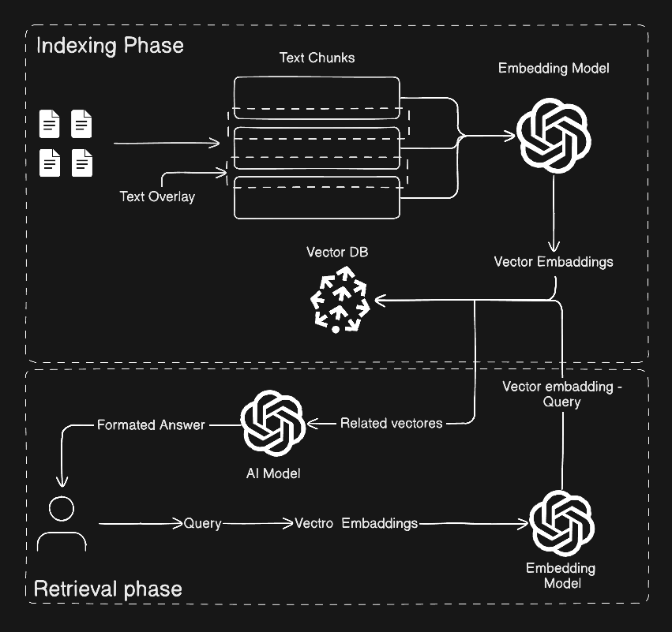

# RAG (Retrieval-Augmented Generation)

This repository demonstrates a complete, practical implementation of a Retrieval-Augmented Generation (RAG) pipeline using LangChain, Qdrant, and modern embedding models. It shows how to load PDF documents, split them into semantic chunks, generate vector embeddings, store them in a vector database, and retrieve relevant information to answer user questions using AI.

The project includes both indexing and retrieval workflows, supporting OpenAI and local embedding models, and provides optimized examples for CPU and GPU environments. This serves as a hands-on guide for building AI-powered document search systems, knowledge assistants, and chat-with-your-data applications.

RAG is a technique used in AI to allow language models to access and use external data, such as documents, files, or databases. Instead of relying only on the model’s internal training knowledge, RAG retrieves relevant information from external sources and uses it to generate more accurate and context-aware responses.


## Features

- Complete end-to-end RAG pipeline implementation
- PDF document loading and processing
- Automatic document chunking using LangChain text splitters
- Vector embedding generation using OpenAI and HuggingFace models
- Vector storage and similarity search using Qdrant vector database
- Fast semantic search for accurate information retrieval
- Support for both cloud-based (OpenAI) and local embedding models
- GPU-optimized indexing for high-performance processing
- Interactive query system for real-time question answering
- Modular and production-ready architecture
- Compatible with custom documents and knowledge bases
- Easy integration with local or cloud LLMs


When using RAG, the document processing is typically divided into two main phases:


## Phase 1: Indexing Phase

This phase prepares the documents so they can be efficiently searched and retrieved later.

- **Chunking the documents:**  
  Large documents are split into smaller pieces called chunks. This improves retrieval accuracy and ensures that only relevant parts of the document are used during queries.

- **Converting chunks into vectors (embeddings):**  
  Each chunk is converted into a numerical representation called a vector using an embedding model. These vectors capture the semantic meaning of the text.

- **Storing vectors in a vector database:**  
  The generated vectors are stored in a vector database (such as FAISS, Pinecone, or Chroma). This allows fast similarity search to find the most relevant chunks when needed.




## Let's Start ! 
**1- Pull the qurden image first (Qurden is an Vector DB):**

```bash
docker compose up
```
**2- Install Langchain document tools:**
```bash 
# this will install 2 packages 
pip install -qU langchain-community pypdf
```
**3- Index the file:**

```Python
from pathlib import Path
from langchain_community.document_loaders import PyPDFLoader

pdf_file = Path(__file__).parent/"pythonbook.pd"

#Load this file 
loader = PyPDFLoader(pdf_file)
# this will gives page by page
pages = loader.load() 
 ```
 after this code, you will have access to each page in your pdf file

**4- File Chunking:**
by using Text splitter integrations : https://docs.langchain.com/oss/python/integrations/splitters

Install the lib 
```bash 
pip install -U langchain-text-splitters
```
and the over all code will be (step 3 code will be updated with )
```Python
from pathlib import Path
from langchain_community.document_loaders import PyPDFLoader
from langchain_text_splitters import RecursiveCharacterTextSplitter 
#The RecursiveCharacterTextSplitter attempts to keep larger units (e.g., paragraphs) intact.

pdf_file = Path(__file__).parent/"pythonbook.pd"

#Load this file 
loader = PyPDFLoader(pdf_file)
# this will gives page by page
pages = loader.load() 

text_splitter = RecursiveCharacterTextSplitter(
    chunk_size = 1000,
    chunk_overlap = 100 #this will make your splitter takes a part of the above pragraph , so there are a link with its
)

chunks = text_splitter.split_text(pages)
```

**4- Vector Embadding:**
To create the vector embadding , we need to use embadding model, in this example we are going to use OpenAI embadding model

NOTE: to use this model you need OpenAI key

```bash 
# install openAI embadding model 
pip install -qU langchain-openai
# Qudren db bradge 
pip install -qU langchain-qdrant

```
after that what you are able to 1- read the pdf file ,2- convert it to chunks , 3- convert it to chunks and save it , and the updated code will be :
```python 
from pathlib import Path
from langchain_community.document_loaders import PyPDFLoader
#The RecursiveCharacterTextSplitter attempts to keep larger units (e.g., paragraphs) intact.
from langchain_text_splitters import RecursiveCharacterTextSplitter 
from langchain_openai import OpenAIEmbeddings
from langchain_qdrant import QdrantVectorStore


pdf_file = Path(__file__).parent/"pythonbook.pd"

#Load this file 
loader = PyPDFLoader(pdf_file)
# this will gives page by page
pages = loader.load() 

text_splitter = RecursiveCharacterTextSplitter(
    chunk_size = 1000,
    chunk_overlap = 100 #this will make your splitter takes a part of the above pragraph , so there are a link with its
)

chunks = text_splitter.split_text(pages)

#Important : You need to set your API key 
# To use embadding model and convert it to vector you need qudren db bradge 
embading_model = OpenAIEmbeddings(model="text-embedding-3-large")

# pass all the chunks, model , your db path url 
qudren_vector = QdrantVectorStore.from_documents(
    documents=chunks,
    embedding=embading_model,
    url = "http://localhost:6333",
    collection_name="python_collection",
)

print("Done!")
```
## Enhancment:
This script maximizes throughput by using PyMuPDFLoader for fast parsing and batching vectors to the GPU.

```Python 
from langchain_huggingface import HuggingFaceEmbeddings
from langchain_community.document_loaders import PyMuPDFLoader
from langchain_text_splitters import RecursiveCharacterTextSplitter
from langchain_qdrant import QdrantVectorStore
from pathlib import Path 
from tqdm import tqdm # progress lib

file_path = Path('pythonbook.pdf')
model_name = ''
qudren_db_url = 'http://localhost:6333'
qudren_db_name = 'pythonbook'

#1- Setup GPU Embadding 
print("Setup GPU Embedding...")
embadding  = HuggingFaceEmbeddings(
    model_name = model_name,
    model_kwargs = { 'device' : 'cuda'},
    encode_kwargs={'normalize_embeddings': True, 'batch_size': 128}
)

print("Load PDF file...")
#2- Load and Split the file 
docs = PyMuPDFLoader(str(file_path)).load()
splitter = RecursiveCharacterTextSplitter(
    chunk_size = 1000, 
    chunk_overlap = 250
).split_documents(docs)

# 3. Batch Processing with Progress Bar
batch_size = 64  # How many chunks to send to Qdrant at once
vectorstore = None
print(f"Indexing {len(splitter)} chunks...")
for i in tqdm(range(0 ,len(splitter), batch_size)) :
    batch  = splitter[i: i+batch_size]
    if vectorstore is None :
        vectorstore = QdrantVectorStore.from_documents(
            documents= batch,
            embedding= embadding,
            url= qudren_db_url,
            collection_name = qudren_db_name
        )
    else:
        vectorstore.add_documents(batch)

print(f"{'==' * 10}> Done <{'==' * 10}")
```

## Phase 2: Retrieval Phase

This phase happens when the user asks a question, and the system retrieves the most relevant information to generate an accurate response.

- 1- Convert the user query into a vector (embedding): The user’s question is converted into a vector using the same embedding model that was used during the indexing phase. This ensures consistency in how semantic meaning is represented.

- 2- Search the vector database for similar vectors: The vector database compares the query vector with the stored document vectors and finds the most similar ones. These matching vectors represent the most relevant document chunks.

- 3- Retrieve the corresponding document chunks: Once the closest vectors are found, their associated text chunks are retrieved from the database.

- 4- Provide the retrieved data to the language model: The retrieved chunks are sent to the language model as additional context. The model uses this information to generate a more accurate and context-aware response.

- 5- Generate and return the final response: The language model combines the retrieved information with its reasoning ability to produce a structured and relevant answer for the user.

### Using OpenAI

NORE : You must use the same embedding model you used with the same collection name 

```python
from langchain_qdrant import QdrantVectorStore
from langchain_openai import OpenAIEmbeddings
from dotenv import load_dotenv
from openai import OpenAI

# to load Open AI key 
load_dotenv()


# openai client for the response 
openai_client = OpenAI()

qudren_db_url = 'http://localhost:6333'
qudren_db_name = 'pythonbook_open_ai'

#1- setup embadding model 
embedding = OpenAIEmbeddings(
    model="text-embedding-3-large"
)

#2- setup vector db 
vector_db = QdrantVectorStore.from_existing_collection(
    url=qudren_db_url , 
    collection_name= qudren_db_name , 
    embedding= embedding
)

#3- take the user inputs
while True:
    user_input = input("Hi , How I can support you today?: ")

    #4- start the similarity search from your vector db , this will return a list of relevent chunks 
    search_result = vector_db.similarity_search(query=user_input)


    #5- pass your result to LLM model to get formated answer 
    context = [f"Page content: {result.page_content}\nPage Number:{result.metadata['page_label']}, Soruce:{result.metadata['source']}" 
            for result in search_result]

    SYSTEM_PROMPT = f"""
    You are a helpful AI assistant who answeres user query based on the avilable context retrived from PDF file along wiht the page content and numbers
    Format the answer based on the file content to assist the user 

    Relevant content: 
    {context}
    """

    response  =  openai_client.chat.completions.create(
        model="gpt-5",
        messages= [
            {"role": "system" ,"content" :SYSTEM_PROMPT},
            {"role": "user" ,"content" :user_input},
        ]
    )
    print(response.choices[0].message.content) 
```


### Using local model like Gemma

Note: You need a GPU to run this code :

```python
from langchain_huggingface import HuggingFaceEmbeddings
from langchain_qdrant import QdrantVectorStore


qdrant_db_url = 'http://localhost:6333'
qdrant_db_name = 'pythonbook'
model_name='google/embeddinggemma-300m'


# setup embadding model 
embedding = HuggingFaceEmbeddings(
    model_name = model_name, 
    model_kwargs = { 'device' : 'cuda'},
    encode_kwargs={'normalize_embeddings': True, 'batch_size': 128}
)

# setup vector db 
vector_db = QdrantVectorStore.from_existing_collection(
    url = qdrant_db_url , 
    collection_name= qdrant_db_name,
    embedding=embedding
)


#take user input 
while True:
    user_input = input ("Hi , How I can support you today?: ")
    search_result = vector_db.similarity_search(query=user_input)
    # context = [f"Page content: {result.page_content}\nPage Number:{result.metadata['page_label']}, Soruce:{result.metadata['source']}" 
    #         for result in search_result]
    
    result = [f"{res.page_content}" for res in search_result]
    print(result)

#and here the result you can pass to some open source ai model like Gemma
```
